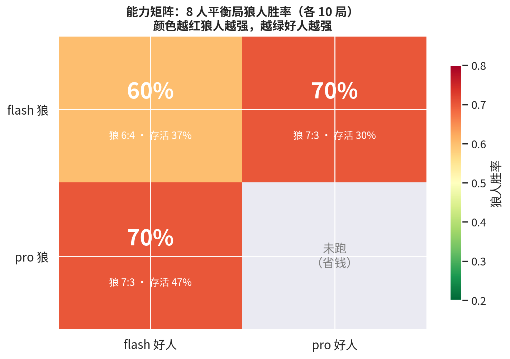

# 🐺 Multi-Agent Werewolf · 多智能体狼人杀

> 让多个 LLM 扮演玩家，在严格信息隔离下自主完成整局狼人杀博弈。
> 支持跨模型混编对局、批量实验、断点续跑与 AI 解说复盘。


## 项目亮点

- **严格的信息隔离架构**：GameMaster（上帝）是唯一掌握全量真相的角色；每个 PlayerAgent 只能收到发给自己的信息，私有记忆（身份/验人结果/夜间行动/狼人频道）与公开记忆物理分离，从架构上杜绝信息泄露
- **多模型混编对抗**：每个玩家可独立配置模型（OpenAI 兼容接口），支持"强模型当狼 vs 弱模型当好人"这类能力不对称实验
- **工程级健壮性**：每次 LLM 调用带超时 + JSON 结构化解析失败自动重试 + 重试耗尽随机兜底，**50+ 局真实对局无一局中断**；阶段边界 checkpoint 支持断电/断网后精确续跑（记忆、药剂、存活状态全保留）
- **完整实验闭环**：批量实验脚本（断点续跑 + 胜率统计）→ AI 解说员复盘（基于完整 reasoning 内心链）→ HTML 回放页 → 胜率可视化
- **完整规则实现**：狼人夜间私密频道协商、预言家验人、女巫双药（同晚限一瓶、仅首夜可自救）、猎人开枪（被毒不能开）、平票处理、屠边胜负判定

## 架构

```
                    ┌─────────────────────────────┐
                    │        GameMaster（上帝）     │
                    │  唯一全知 · 状态机驱动        │
                    │  夜晚→白天→胜负判定           │
                    └───────┬───────────┬─────────┘
                   公开广播  │           │  私密投递
              ┌─────────────┘           └─────────────┐
        ┌─────▼─────┐  ┌─────────┐  ┌─────────┐  ┌───▼─────┐
        │ PlayerAgent│  │PlayerAgent│ │PlayerAgent│ │PlayerAgent│
        │ 狼人 A(pro)│  │ 狼人 B(pro)│ │预言家(flash)│ │ 女巫(flash)│  ...
        └─────┬─────┘  └────┬────┘  └─────────┘  └─────────┘
              └──────┬──────┘
              狼人私密频道（仅狼人可见）
                     │
        每个 Agent = 角色 System Prompt + 私有记忆 + 公开记忆
        所有决策 = JSON 结构化输出（解析失败带反馈自动重试）
                     │
              全量事件 → game_log.jsonl（含每次调用完整 prompt / 回复 / reasoning）
                     │
        ┌────────────┼────────────┬──────────────┐
        ▼            ▼            ▼              ▼
   HTML 回放页   AI 解说员复盘   批量实验统计   胜率可视化
```

## 快速开始

```bash
pip install -r requirements.txt

# Windows
set LLM_BASE_URL=https://api.deepseek.com/v1
set LLM_API_KEY=sk-xxx
# Linux/macOS
export LLM_BASE_URL=https://api.deepseek.com/v1
export LLM_API_KEY=sk-xxx

python main.py --replay --review      # 跑一局 + HTML 回放 + AI 解说复盘
python main.py --games 3              # 连跑 3 局
WEREWOLF_MOCK=1 python main.py        # Mock 模式离线测试（无需 API Key）
```

批量实验（支持断点续跑，可反复调用直到跑满）：

```bash
python run_experiment.py --config config_pro_wolves_8p.yaml \
    --logdir logs_8p --total 10 --budget 240
```

## 实验结果（5 组 × 10 局真实对局）

**能力矩阵 · 8 人平衡局（3 狼 + 预/女/猎 + 2 民）狼人胜率：**

| 狼 \ 好人 | flash 好人 | pro 好人 |
|---|---|---|
| **flash 狼** | 60%（6:4） | 70%（7:3） |
| **pro 狼** | 70%（7:3） | 未跑 |



关键发现（详见 [实验报告](docs/EXPERIMENT_REPORT.md)）：

1. **配置效应（±40pp）远大于模型效应（±10-20pp）**：6 人局好人碾压、8 人 3 狼局狼人占优
2. **反直觉：强模型当好人反而压不住狼**——pro 好人抓狼更准（狼存活率降至 30%），但狼队只需把好人犯错"武器化"即可取胜
3. 强模型当狼提升真实：pro 狼存活率 47%，显著高于 flash 狼的 30-37%

## 项目结构

```
├── main.py                    # 入口：单局/多局 + 回放 + 复盘
├── run_experiment.py          # 批量实验：断点续跑 + 胜率统计
├── config.yaml                # 玩家/角色/模型/规则 全配置驱动
├── werewolf/
│   ├── gamemaster.py          # 上帝：状态机 + checkpoint 断点续跑
│   ├── player.py              # PlayerAgent：双层记忆 + 结构化决策
│   ├── roles.py               # 角色 System Prompt（狼/预/女/猎/民）
│   ├── llm.py                 # 异步 LLM 客户端：超时/重试/JSON 解析
│   ├── logger.py              # JSONL 结构化日志 + 控制台输出
│   ├── review.py              # AI 解说员复盘
│   └── replay.py              # HTML 回放页生成
├── docs/EXPERIMENT_REPORT.md  # 完整实验报告
└── logs*/                     # 各实验组对局日志与统计
```

## 路线图

- [x] 6 人局（2 狼 + 预/女 + 2 民）
- [x] 8 人局 + 猎人
- [x] 多模型混编与批量实验
- [x] AI 解说复盘 / HTML 回放
- [ ] 更大规模样本（50-100 局/组）收窄置信区间
- [ ] Elo 评分体系：模型间循环赛排名
- [ ] 更多角色（守卫/白痴/骑士）与 12 人标准局

## License

MIT
