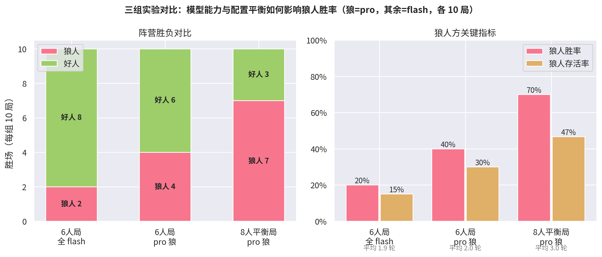

# 多智能体狼人杀实验报告

> 模型能力与配置平衡如何影响多智能体博弈结果
> 实验平台：deepseek-v4-flash / deepseek-v4-pro · 共 5 组 × 10 局真实对局

## 1. 实验背景与问题

多智能体博弈是评估 LLM 推理、伪装、协作与策略能力的天然试验场。狼人杀兼具**不完备信息推理**（好人视角）、**蓄意欺骗**（狼人视角）与**多轮动态博弈**，比单轮问答更能暴露模型的真实决策能力。

本实验回答三个问题：

1. 模型能力差异（flash vs pro）对博弈结果有多大影响？
2. 配置平衡（6 人 2 狼 vs 8 人 3 狼）与模型能力，哪个是主导因素？
3. 强模型在"欺骗方"（狼）和"推理方"（好人）上的能力提升是否对称？

## 2. 实验设置

### 2.1 对局配置

| 配置 | 玩家 | 角色 | 胜负规则 |
|---|---|---|---|
| 6 人局 | 6 | 2 狼 + 预言家 + 女巫 + 2 平民 | 屠边 |
| 8 人平衡局 | 8 | 3 狼 + 预言家 + 女巫 + 猎人 + 2 平民 | 屠边 |

### 2.2 实验分组（每组独立种子，各 10 局）

| 组 | 配置 | 狼模型 | 好人模型 | 目的 |
|---|---|---|---|---|
| A | 6 人局 | flash | flash | 基准 |
| B | 6 人局 | pro | flash | 模型效应（6 人局） |
| C | 8 人局 | pro | flash | 平衡局 + 强狼 |
| D | 8 人局 | flash | pro | 镜像：强防守方 |
| E | 8 人局 | flash | flash | 对照组：分离配置效应 |

### 2.3 实验控制

- **信息隔离**：Agent 仅能访问 GameMaster 投递的信息；私有记忆与公开记忆物理分离，狼人频道仅狼人可见
- **可靠性**：LLM 调用超时 60s + JSON 解析失败重试 2 次（带格式反馈）+ 重试耗尽随机兜底；全程记录每次调用的完整 prompt / 回复 / reasoning
- **断点续跑**：阶段边界 checkpoint，实验跨多次会话/重启无损续跑
- **数据质检**：逐局统计 LLM 调用失败率；剔除 API 全面故障的"随机兜底局"并重跑（实际剔除 2 局）
- 全部有效对局 LLM 调用失败尝试占比 2%-39%（重试机制吸收），无 100% 失败局

## 3. 实验结果

### 3.1 分组结果

| 组 | 狼人胜 | 好人胜 | 狼人胜率 | 狼人存活率 | 平均轮数 |
|---|---|---|---|---|---|
| A · 6 人全 flash | 2 | 8 | 20% | 15% | 1.9 |
| B · 6 人 pro 狼 | 4 | 6 | 40% | 30% | 2.0 |
| C · 8 人 pro 狼 | 7 | 3 | 70% | 47% | 3.0 |
| D · 8 人 flash 狼 vs pro 好人 | 7 | 3 | 70% | 30% | 2.7 |
| E · 8 人全 flash（对照） | 6 | 4 | 60% | 37% | 3.0 |



### 3.2 能力矩阵（8 人平衡局）

| 狼 \ 好人 | flash 好人 | pro 好人 |
|---|---|---|
| **flash 狼** | 60% | 70% |
| **pro 狼** | 70%（存活 47%） | 未跑 |


## 4. 核心发现

### 4.1 配置效应是主导因素（±40pp ≫ 模型效应 ±10-20pp）

6 人局狼人胜率 20-40%，8 人 3 狼局 60-70%。狼人数量从 2→3（占比 33%→37.5%）配合屠边规则，使狼队夜间刀法的边际收益远超好人的白天放逐收益。对多智能体博弈研究的启示：**评估模型博弈能力前，必须先固定并报告配置平衡性**，否则"模型强弱"的结论会被配置淹没。

### 4.2 强模型当狼的提升真实且单调

同配置下（A→B）：狼人胜率 20%→40%，存活率 15%→30%。8 人局 pro 狼存活率 47%，为全场最高。强模型在伪装一致性、带节奏时机、夜间目标选择上的优势可稳定转化为生存率。

### 4.3 反直觉：强模型当好人反而压不住狼

D 组（pro 好人）狼胜率 70%，不低于 E 组（全 flash）的 60%，甚至略高。机制分析（基于 AI 解说员对典型局的复盘）：

- **pro 好人抓狼确实更准**：D 组狼存活率仅 30%（三组中最低），白天放逐质量高
- **但好人阵营的容错率取决于"最严重的错误"而非"平均推理水平"**。典型案例（D 组 game_2）：pro 猎人被刀后基于长推理链开枪——前提错误导致**误杀平民**，狼人立即把这次误杀包装成"被杀者是狼"的假证据，好人连锁误判输掉比赛
- **强模型的长推理链在信息不完备时放大误判杀伤力**：推理越长越自信，前提错了结论错得更"理直气壮"，而狼队只需等待并利用这些错误

### 4.4 欺骗能力 ≠ 推理能力

本实验中"pro 当狼提升存活率"（+10-17pp）比"pro 当好人提升胜率"（约 0 甚至为负）显著得多。说明 LLM 的欺骗/伪装能力与推理/识骗能力并不同步发展——这为"用博弈环境分别评测两类能力"提供了实证依据。

## 5. 局限

- 每组 10 局样本量小，±10pp 的差异处于噪声边缘；结论方向可信，精确数值不宜过度解读
- 单一模型家族（DeepSeek），结论外推到其他厂商模型需谨慎
- pro/pro 象限未测（成本考虑），无法评估"双强"对局的均衡点
- 失败兜底（随机选择）在低比例下存在，可能对个别对局引入噪声

## 6. 复现

```bash
# 任一组实验（以 C 组为例）
python run_experiment.py --config config_pro_wolves_8p.yaml \
    --logdir logs_8p --total 10 --budget 240 --seed-base 3000

# 单局回放 + AI 解说复盘
python main.py --config config_pro_wolves_8p.yaml --replay --review
```

各组原始对局日志（含完整 prompt/回复/reasoning）见 `logs*/game_*.jsonl`，统计见 `logs*/stats.json`。

## 7. 附：技术路线

- **异步优先**：全程 asyncio；无依赖环节并行（白天同时秘密投票、狼人刀人票并行、预言家验人与狼人行动并行），单局耗时降低约 40%
- **结构化输出**：所有决策走 JSON schema 约束输出 + 正则提取 + 失败反馈重试，保证可解析
- **reasoning 模型适配**：reasoning 模型会把 token 预算耗在思考上导致正文为空，通过提高 max_tokens 并单独记录 `reasoning_content` 解决——这些"内心链"同时成为复盘解说的一手素材
- **断点续跑**：阶段边界（夜晚结算后/白天结束后）序列化完整记忆快照（公开/私有记忆、药剂、存活、当夜死讯），进程中断后从上个边界精确恢复，实验跨重启零损失
